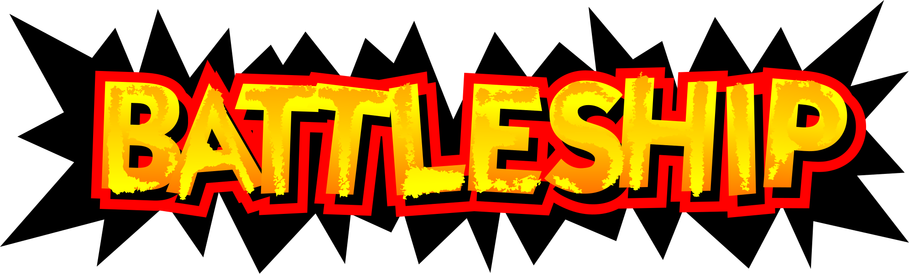

<p align="center">
  
</p>

# SmashBrotatoes

**SmashBrotatoes** is a PC port of **Super Smash Bros. (N64)** — both the **US** (NTSC-U v1.0) and **Japanese** (Nintendo All-Star! Dairantou Smash Brothers) releases — built on top of the [VetriTheRetri/ssb-decomp-re](https://github.com/vetritheretri/ssb-decomp-re) decompilation, using [libultraship](https://github.com/Kenix3/libultraship) for PC-native rendering / audio / input and [Torch](https://github.com/HarbourMasters/Torch) for extracting assets out of the ROM at build time.

Runs natively on Windows.

## No copyrighted assets are included in this repository

**None of Nintendo's assets (code, textures, audio, models, text, ROM data) are checked into this repo or distributed with builds.** The port is a pure C/C++ source tree; every byte of Nintendo-owned data is extracted at build time from a ROM that *you* supply. If you do not own a legal copy of Super Smash Bros. for the Nintendo 64, you cannot build or run this project.

You supply your own ROM. The decomp game code is region-compiled, so US
and JP are separate builds — build the one matching your ROM
(`-DSSB64_VERSION=us|jp`, see [BUILDING.md](BUILDING.md)). The canonical,
supported dumps (internal name `SMASH BROTHERS`):

| Version | Game code | SHA‑1 | MD5 |
|---------|-----------|-------|-----|
| **US** — NTSC-U v1.0 | `NALE` | `e2929e10fccc0aa84e5776227e798abc07cedabf` | `f7c52568a31aadf26e14dc2b6416b2ed` |
| **JP** — Nintendo All-Star! Dairantou Smash Brothers v1.0 | `NALJ` | `4b71f0e01878696733eefa9c80d11c147ecb4984` | `66db457b130d31a286a23d6e4dd9726e` |

If your dump does not match the hashes for its version, it will not work.

## Features

Everything below is toggleable in-game from the ESC menu.

### Input enhancements (per-player)

- **Disable Tap Jump**
- **C-Stick Smash**
- **D-Pad to Jump**
- **NRage analog-stick remap** with customizable per-axis ranges

### Gameplay & match options

- **Classic Co-op** — play the originally single-player Classic mode with 2-player local co-op, with an optional friendly-fire toggle
- **Z-Cancel assists** — Auto Z-Cancel and Flash on Failed Z-Cancel (L-cancel practice aids)
- **Competitive ruleset** — one-click tournament rules, plus neutral spawns on Dream Land
- **Disable Stage Hazards**
- **Hitbox view** — visualize hitboxes / hurtboxes / collision
- **Boot straight to the VS character-select screen**, **Skip Results Screen**, **Force CPU Level 9**
- **Unlocks** — unlock everything, or individual characters (Captain Falcon, Jigglypuff, Luigi, Ness) and features (Mushroom Kingdom, Item Switch menu, Sound Test)

### Audio

- **Music shuffler** — randomize stage BGM
- **Music selection screen** — pick the track per stage
- Independent Master / Music / Sound / Voice volume sliders

### Rendering (powered by libultraship / Fast3D)

- Internal resolution scaling, MSAA anti-aliasing, three-point texture filtering
- Full widescreen support, including ultrawide resolutions.
- Renderer backend selection (Direct3D 11 / OpenGL), VSync, windowed-fullscreen, multi-window
- **Post-process shader support** with an in-app shader-pack downloader

### Textures & mods

- **Hi-res texture packs** (opt-in, read in place straight out of a `.zip`). Download GhostlyDark's pack from [evilgames.eu](https://evilgames.eu/texture-packs/ssb-reloaded.htm#pc).
- **Native C mod support** — write mods in C, compiled at runtime (TinyCC), with hot-reload, function detours, and a documented engine/fighter event catalog. See [`docs/modding.md`](docs/modding.md). *(Windows only.)*

### Controls

- Controller and rumble support powered by **SDL2**, with plug-and-play routing for up to 4 pads
- Native **Raphnet** adapter support up to 4 channels through **hidapi**
- Per-controller configuration UI and a bundled `gamecontrollerdb.txt` mapping database

### Platform & quality-of-life

- Runs natively on **Windows**
- First-run ROM-extraction wizard, built-in update checker/downloader, and Discord Rich Presence

### Rollback netcode & online play

Work in progress.

## Architecture

The port has three layers and they are kept deliberately separate:

```
┌──────────────────────────────────────────────────────────────┐
│  decompiled game code  (decomp/src/)                         │
│  Unmodified C produced by the decomp project. Talks to the   │
│  N64 the same way the original ROM did: GBI display lists,   │
│  ALSeqPlayer audio, OS threads, OSContPad input.             │
├──────────────────────────────────────────────────────────────┤
│  port layer            (port/)                               │
│  Modern C++ glue. Translates N64-shaped APIs into LUS calls, │
│  fixes endianness on freshly-loaded data, owns Ship::Context │
│  and the resource factories, and quarantines every change    │
│  the decomp doesn't need to know about.                      │
├──────────────────────────────────────────────────────────────┤
│  libultraship         (libultraship/)                        │
│  PC-native runtime: Fast3D renderer (Direct3D 11 / OpenGL),  │
│  SDL2 input, miniaudio output, OTR/O2R resource manager,     │
│  ImGui overlay.                                              │
└──────────────────────────────────────────────────────────────┘
```

### Asset pipeline

`baserom.us.z64` is never read at runtime. At build time, **Torch** walks the ROM with the YAMLs under `yamls/us/` and emits `SmashBrotatoes.o2r` — a zip-format archive of typed resources (textures, sequences, sample banks, animations, reloc files). At launch, libultraship's resource manager mounts `SmashBrotatoes.o2r` + `f3d.o2r` and the port code requests resources by path. This is the same pipeline used by Ship of Harkinian, Starship, SpaghettiKart, etc.

The relocatable-data files (fighter tables, item tables, effects, sprites) are SSB64-specific and required custom factories on the Torch side and a custom loader (`port/resource/RelocFileFactory.cpp`) on the runtime side.

### Generated code (committed)

A set of files is generated by the Python tools in `tools/` from the tracked symbol source `tools/reloc_data_symbols.{us,jp}.txt`, and **committed to the repo** so a fresh clone and CI build without re-running the generators (and, for the YAMLs, without the ROM). Regenerate and re-commit only when the symbol source changes — rare for a frozen v1.0 ROM:

- `include/reloc_data.{us,jp}.h` — extern declarations for every relocatable symbol, selected at compile time by the `decomp/include/reloc_data.h` shim (`REGION_US` / `REGION_JP`)
- `port/resource/RelocFileTable.{us,jp}.cpp` — the runtime symbol table
- `yamls/us/reloc_*.yml` — Torch extraction configs (regenerating these also reads the ROM, so committing them is what keeps CI ROM-free)

The CMake targets `GenerateRelocArtifacts` and `RegenerateRelocYamls` rebuild them on demand. If you edit `reloc_data_symbols.*.txt`, regenerate and re-commit; a stale table surfaces as an "undefined reference to `dFooBarReloc`" link error.

---

## Code conventions

### `#ifdef PORT` — what it is and what it isn't

Every meaningful change to a decomp source file is wrapped in `#ifdef PORT` / `#else` / `#endif`. The discipline this enforces:

- **The original decomp code path stays intact and compilable** under the IDO toolchain on a real N64 build. This is non-negotiable — if it ever stops being true, upstreaming improvements back to the decomp project becomes impossible.
- **The PORT branch is allowed to be ugly** — an explicit endian conversion, a struct rewrite, a function shim — as long as the contract it presents to the rest of the file is the same as the N64 branch.
- **Reloc tokens vs. raw pointers**: a field declared `u32` under `#ifdef PORT` where the N64 branch declared `T*` is a *reloc token*, not a raw pointer. Resolving it requires `PORT_RESOLVE(token)`. Assigning a real pointer with `(uintptr_t)ptr` will silently truncate on LP64 — wrap post-load writes in `PORT_REGISTER`.

### Decomp preservation: behavior, not bytes

The repo follows a single principle for changes to `decomp/src/`:

> **Accuracy to game behavior > accuracy to ROM bytes.**

That means IDO idioms that encode original N64 semantics — odd casts, `goto` flow, deliberate temporaries — are load-bearing and stay. But **compiler-compat shims** (warning suppressions, permissive flags, header shortcuts) that mask real bugs on modern LP64 toolchains do *not* survive. The most expensive lesson of the project was that `-Wno-implicit-function-declaration` was silently truncating 64-bit pointer returns to 32-bit `int` in dozens of places — see `docs/bugs/item_arrow_gobj_implicit_int_2026-04-20.md`. The shim is gone; the real declarations are in.

### Naming prefixes

The decomp uses two-letter module prefixes throughout. Knowing them makes the source tree navigable:

| Prefix | Meaning |
|--------|---------|
| `ft`   | Fighter (`ftMario`, `ftKirby`, `ftFox`, …) |
| `it`   | Item (`itAttribute`, `itManager`) |
| `wp`   | Weapon |
| `ef`   | Effect / particle |
| `gm`   | Game mode |
| `gr`   | Stage (ground) |
| `mp`   | Map / collision |
| `mn`   | Menu |
| `sc`   | Scene |
| `sy`   | System (engine internals) |
| `sf`   | Saved-state / save file |
| `db`   | Debug |
| `cm`   | Camera |
| `lb`   | Library (low-level utilities) |
| `obj`  | GObj / DObj / OMObj — game-object wrappers |

Full reference: [`docs/c_conventions.md`](docs/c_conventions.md).

### Endianness handling

The N64 is big-endian; PC targets are little-endian. The port handles this in three layers:

1. **Gross byteswap at load** — `lbRelocLoadAndRelocFile` byteswaps relocatable files word-by-word during load.
2. **Per-struct fixups** — small `portFixupStructU16` / `portFixupStructU8` helpers fix sub-word fields that the gross swap got wrong (e.g., `{u16, u8, u8}` patterns where the two `u8`s end up swapped).
3. **Per-stream walkers** — animation events, spline interpolators, and other variable-length streams are halfswapped at file-bake time and need a per-stream un-halfswap on first access. These live in `port/port_aobj_fixup.{h,cpp}` and friends.

If you find a new struct that reads garbage, the playbook in `docs/n64_reference.md` will tell you which layer it belongs in.

### Bitfield layout

The IDO compiler packs small bitfields into preceding `u16` pad gaps, MSB-first. Modern compilers (Clang, GCC) on LE targets pack LSB-first into the next storage unit. Bitfield structs that travel through file data must be **rewritten under `#ifdef PORT`** to match the IDO physical layout — see `docs/debug_ido_bitfield_layout.md` for the workflow (compile + rabbitizer disasm to verify bit positions before porting).

Patching the *reads* in game code instead of the *layout* is forbidden by team policy; the bug always comes back. See `feedback_struct_rewrite_over_overrides.md` in the project's memory for the long version.

---

## Vendored components (`decomp`, `libultraship`, `torch`)

These three live directly in this repository as ordinary folders. Each began as a fork carrying SSB64-specific changes and is now maintained here as part of this project — it is a self-contained hard fork, not tracking upstream. The SSB64-specific work each carries:

### `libultraship` — from [Kenix3/libultraship](https://github.com/Kenix3/libultraship)

SSB64 drives the RDP differently than the Zelda / Mario 64 / Star Fox 64 titles libultraship was originally built for — in particular around tile masks, `SetTileSize` extents, IA/I4 texture uploads, and `gDPSetPrimDepth` for 2D layering:

- Clamping `ImportTexture*` upload width/height to the active `SetTileSize` extent (fixes the fighter "black squares" bug and the IA8/I4 stretch bug)
- Honouring `SetTile` mask/maskt in the Import* path
- A real implementation of `gDPSetPrimDepth` (was a `TODO Implement` stub upstream — broke every `G_ZS_PRIM` 2D sprite)
- A no-logging path in `IResource`'s destructor to prevent a shutdown-time crash

### `torch` — from [HarbourMasters/Torch](https://github.com/HarbourMasters/Torch)

Torch is the tool that reads the ROM and emits `SmashBrotatoes.o2r`. Upstream supports OoT, MM, SF64, MK64, PM64, etc., but has no knowledge of SSB64's file formats:

- An `SSB64` build flag and game target
- A reloc-file factory for SSB64's relocatable data blobs (fighters, items, effects, sprites)
- `libvpk0` integration for VPK0-compressed segments

### `decomp` — from [VetriTheRetri/ssb-decomp-re](https://github.com/VetriTheRetri/ssb-decomp-re)

The SSB64 C decompilation this port is built on; port-specific changes are `#ifdef PORT`-guarded so the code stays close to the original game logic. See the attribution section below for licensing.

---

## Repo layout

```
port/         modern C++ port layer — Ship::Context, resource factories,
              endian fixups, bridges between decomp code and libultraship
                port/hooks/     engine/fighter event system
                port/mods/      native C mod loader + hook backend (funchook)
workspace/    worked example mods (hooktest, playertint, template)
include/      headers (some generated: reloc_data.h)
decomp/       decompiled SSB64 C source (largely unchanged game logic).
              Major subdirs:
                src/sys/        main loop, DMA, scheduling, audio,
                                controllers, threading
                src/ft/         fighters (ftmario/, ftkirby/, ftfox/, …)
                src/sc/ gm/ gr/ scene / game modes / stage rendering
                src/mn/ it/ ef/ menus / items / effects
                src/relocData/  reloc data sources
libultraship/ PC-native render / audio / input / resource mgr
torch/        asset extractor (ROM → SmashBrotatoes.o2r)
yamls/us/     Torch YAML extraction configs (some generated)
tools/        Python helpers: reloc stubs, YAML gen, credits encoder
docs/         architecture notes, bug write-ups, debugging guides
debug_tools/  optional disasm / diff utilities (not required for a build)
scripts/      packaging (.zip), worktree helper
```

### Further reading

- [`docs/modding.md`](docs/modding.md) — writing native C mods: the event catalog, function detours, and fighter override points
- [`docs/architecture.md`](docs/architecture.md) — project status, ROM info, dependency map, source-tree layout
- [`docs/c_conventions.md`](docs/c_conventions.md) — decomp naming prefixes, IDO idioms to preserve, code style, macros
- [`docs/n64_reference.md`](docs/n64_reference.md) — RDRAM, RSP/RDP, GBI, audio, threading, endianness primer
- [`docs/build_and_tooling.md`](docs/build_and_tooling.md) — CMake details, reloc stub regen, runtime logs, LP64 compat notes
- [`docs/debug_gbi_trace.md`](docs/debug_gbi_trace.md) — capturing GBI traces from the port and a M64P plugin, diffing with `gbi_diff.py`
- [`docs/debug_ido_bitfield_layout.md`](docs/debug_ido_bitfield_layout.md) — verifying ported struct bit positions against IDO output via rabbitizer
- [`docs/bugs/README.md`](docs/bugs/README.md) — active bug log (open items only; resolved write-ups are pruned)

---

This project is **not affiliated with, endorsed by, or authorized by Nintendo.** It is a personal, non-commercial research and preservation effort. Do not upload ROMs, extracted `.o2r` archives, or any other Nintendo-owned data to issues or pull requests.

This project is **not affiliated with, endorsed by, or authorized by Harbour Masters** either. It uses libultraship (originated by the Harbour Masters team and now maintained at [Kenix3/libultraship](https://github.com/Kenix3/libultraship)) and Torch (the [HarbourMasters/Torch](https://github.com/HarbourMasters/Torch) asset extractor) as upstream dependencies via personal forks, but it is an independent fan effort. Issues, bugs, and support questions about this port should not be directed to the Harbour Masters team.